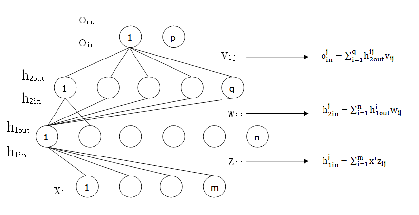
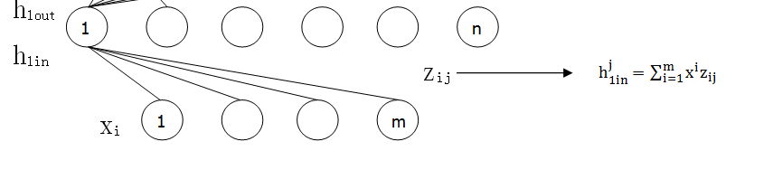
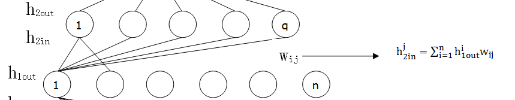
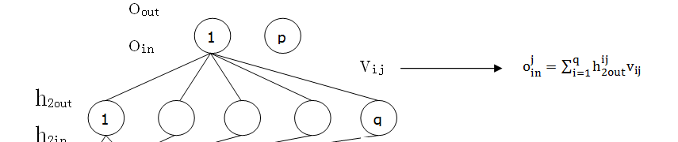
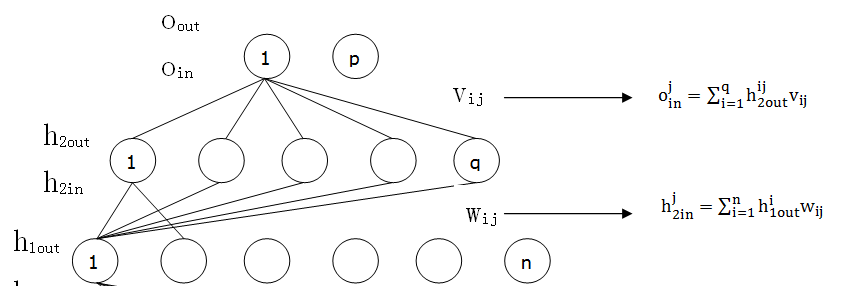

# BP算法的基本运算过程

> BP主要就是两部分组成，前向采用全连接方式去计算结果，用来输出我们的目标值，反向是根据我们的目标值和真实目标值的差距反向逆推去修正各个边的权重，这就好比正向是$w_1x_1+w_2x_2+w_2x_2+w_3x_3=y$ ,根据我们的$x_i$ 及相应的权重$w_i$ 正向求解除目标值$y$ ，然后再根据真实的$Y$ 与我们的$y$ 进行比较去反馈修正权值$w_i$ 一样。

假定我们的输入为一向量X，具体为$X=[x_1, x_2, x_3,...., x_m]$ 

隐藏层$h_1$ 设置n个节点，分别为$h_1 = [h_1^1, h_1^2, h_1^3,..., h_1^n]$

隐藏层$h_2$ 设置q个节点，分别为$h_2 = [h_2^1, h_2^2, h_2^3,..., h_2^n]$ 

输出层o   设置p个节点，分别为$O=[o_1, o_2, o_3,...,o_p]$ 

规定下标，申明下先后顺序：从A层到B层的权值为如果为：$\theta_{ij}$  ,i表示的是A层的向量长度，j表示B层的节点个数 

## 正向传播过程

#### 输入层到h1层

首先根据输入层的X以及输入层到隐藏h1层的权值V，我们可以求出隐藏层各个节点的数值：

$ h_{1in}^j = \sum_{i=1}^m x^iz_{ij} +\alpha $  

这个公式表示的是隐藏层第h个节点的数值计算方式为前一层每个节点值乘以该前一层节点到当前隐藏层节点的连线权值，就如同开始讲的,假如我们求取隐藏层第一个节点值：

此时$j=1$：   $h_{1in}^1 = z_{11}x^1+z_{21}x^2+z_{31}x^3+...+z_{m1}x^m+\alpha$ 

此时$h=2$：   $h_{1in}^2 = z_{12}x^1+z_{22}x^2+z_{32}x^3+...+z_{m2}x^m+\alpha$  

通过这种方式我们可以求得隐藏层h1每个节点的值，但是隐藏层向外输出的时候我们一般会进行一个非线性转换，这个是神经网络的一个主要特征，解决了原本模型只能判断线性可分的缺点；也就是将原本隐藏层的计算结果$h_{1in}^j$  通过加偏置和非线性转换作为隐藏层输出结果：

这里选用一个非线性转换sigmoid函数：$f(x)=\frac{1}{1+e^{-x}}$ 

所以隐藏层实际输出  $h_{1out}^j = \frac{1}{ 1+e^{- h_{1in}^j}} $     

#### h1层到h2层

 

首先根据隐藏h1层的$h_{1out}$以及隐藏h1层到隐藏h2层的权值w，我们可以求出隐藏h2层各个节点的数值：

$ h_{2in}^j = \sum_{i=1}^n h_{1out}^i w_{ij} +\beta$    

这个公式表示的是隐藏层第h个节点的数值计算方式为前一层每个节点值乘以该前一层节点到当前隐藏层节点的连线权值

通过这种方式我们可以求得隐藏层h2每个节点的值，但是隐藏层向外输出的时候我们一般会进行一个非线性转换，这个是神经网络的一个主要特征，解决了原本模型只能判断线性可分的缺点；也就是将原本隐藏层的计算结果$h_{2in}^j$  通过加偏置和非线性转换作为隐藏层输出结果：

这里选用一个非线性转换sigmoid函数：$f(x)=\frac{1}{1+e^{-x}}$ 

所以隐藏层实际输出  $h_{2out}^j = \frac{1}{ 1+e^{- h_{2in}^j}} $      

#### h2层到输出层

 

一样的道理我们可以求得输出层的值 $ o^j_{in} = \sum_{i=1}^q h_{2out}^i v_{ij}+\gamma$  

输出层的真实输出也是经过了一个非线性转换 ,则实际的输出为： $o_{out}^j = \frac{1}{1+e^{-o^j_{in}}}$ 

实际输出就是我们的结果，可以与真实值进行对比，如果越接近，代表模型越准确。

## 反向传播过程

当我们知道了求解出来的$O_{out}$和真实值$Y$之后，如何去对模型进行优化使得下次输出的$O_{out}$更趋向于$Y$呢？这里我们的目标就是尽量使得$Y -O_{out}$$趋向于0，有个很简单的思想就是使用变量梯度优化思想去寻找最底端。

目标函数就是$E(w,v,z|x)=(Y-O_{out})^2$ ，即在x给定的前提下不断的优化w和v使得$E(w,v,z|x)=>0$ 

这个式子相信大家都很熟悉了，只要我们求得其对应于w、z和v的梯度，便可以将w、z和v向相反的反向下滑，直至到最底端，结果使得$E(w,v,z|x)$ 达到最小。

####  计算h2到输出层的每个权值v 

 

$v_{ij} = v_{ij} - \eta\nabla E^\prime_{v_{ij}}$    

这里目标函数中的Y因为是一个向量，一般写成：$E(v, w,z|x) = \frac{1}{2}\sum_{i=1}^{l} (y_i-o_{out}^i)^2$    

第一步，如果要对隐藏层到输出层的权值w进行更新，按照我们写的就是要对其求偏导得梯度：

$E^\prime_v = \frac{\partial E}{\partial v}$   

这里隐藏层有q个节点, 输出层有p个节点，权值w按照$v_{qp}$ 命名的话，又可以细化到对每个权值：

$E^\prime_{v_{ij}} = \frac{\partial E}{\partial v_{ij}}$   

这里i代指隐藏层h2节点i，j代指输出层O节点j；

由于f函数也是经过输出层h2输入非线性转换后再均方误差才得到的，那我们可以写成：

$E^\prime_{v_{ij}} = \frac{\partial E}{\partial o^j_{out}} \frac{\partial o^j_{out}}{\partial o^j_{in}} \frac{\partial o^j_{in}}{\partial v_{ij}}$  

根据上面的关于$o^j_{out}$ 的定义，y函数是对 $o^j_{in}$结果通过sigmoid函数进行了一次非线性转换，而$o^j_{in}$值是由全链接求得，我们分为三部分分别求导试试：

$E^\prime(o^j_{out}) = -(y_j -o^j_{out})$     

$o^j_{out}= \frac{1}{1+e^{-o^j_{in}}} $  ==> $\frac{\partial o^j_{out}}{\partial o^j_{in}} = o^j_{out}(1-o^j_{out})$    
$o^j_{in}= \sum_{i=1}^q h_{2out}^i v_{ij}+\alpha$ ==> $\frac{\partial o^j_{in}}{\partial v_{ij}} =  h_{2out}^i$   

这里写个代指，后面有用：

$g_j= \frac{\partial E}{\partial o^j_{out}} \frac{\partial o^j_{out}}{\partial o^j_{in}} =-(y_j -o^j_{out})o^j_{out}(1-o^j_{out})$   

综合起来就是：

$E^\prime_{v_{ij}} = g_jh^i_{2out}$    

所以最终更新方式就是$v_{ij} = v_{ij} - \eta\nabla E^\prime_{v_{ij}}$ 。

这里假设前向运算结果中原来权值$v_{ij}=0.9$，计算得到$f(o^j_{ij})=0.8$ , 隐藏层输出$h^i_{2out}=0.7$ ，学习速率$\eta=0.01$ ,那么新的权值：

$v_{ij} = 0.9 - 0.01\times0.8\times(1-0.8)\times0.7=0.89888$   

#### 计算h2层到h1层的每个权值w 

 

$w_{ij} = w_{ij} - \eta\nabla E^\prime_{w_{ij}}$      

这里目标函数中的Y因为是一个向量，一般写成：$E(v, w,z|x) = \frac{1}{2}\sum_{i=1}^{l} (y_i-o_{out}^i)^2$    

在进行$w_{ij}$ 偏导求取时(举例：明确一个东西就是反馈的时候$h^q_{2out}$ 会接收到从$o^k_{in}$ 节点传下来的误差，其中$k \in \{1,2,...,p\}$， 需要合并误差才可以，也就是每个输出都会反馈给h2隐藏层一个误差)：

$E^\prime_{w_{ij}} =  \frac{\partial E}{\partial w_{ij}}= \frac{\partial E}{\partial h^j_{2out}} \frac{\partial h^j_{2out}}{\partial h^j_{2in}} \frac{\partial h^j_{2in}}{\partial w_{ij}}$   其中 $\frac{\partial E}{\partial h^j_{2out}}=\sum_{k=1}^p \frac{\partial E}{\partial o^k_{out}} \frac{\partial o^k_{out}}{\partial o^k_{in}} \frac{\partial o^k_{in}}{\partial h^j_{2out}}$         

继续拆分：

$\frac{\partial E}{\partial o^k_{out}}  = -(y_k -o^k_{out})$       

$o^j_{out}= \frac{1}{1+e^{-o^j_{in}}} $  ==> $\frac{\partial o^k_{out}}{\partial o^k_{in}} = o^k_{out}(1-o^k_{out})$     
$o^j_{in}= \sum_{i=1}^q h_{2out}^i v_{ij}+\alpha$ ==> $\frac{\partial o^k_{in}}{\partial h^j_{2out}} = v_{jk} $    

$\frac{\partial h^j_{2out}}{\partial h^j_{2in}}=h^j_{2out}(1-h^j_{2out})$  

$\frac{\partial h^j_{2in}}{\partial w_{ij}}=h^i_{1out}$  

这里写个代指，后面有用：

$g_j= \frac{\partial E}{\partial o^j_{out}} \frac{\partial o^j_{out}}{\partial o^j_{in}} =-(y_j -o^j_{out})o^j_{out}(1-o^j_{out})$   

 $\delta_{h2} =  h^j_{2out}(1-h^j_{2out}) \sum_{k=1}^p g_k v_{jk}$      

综合起来就是：

$E^\prime_{w_{ij}} = \delta_{h2}  h^i_{1out}$      

所以最终更新方式就是$w_{ij} = w_{ij} - \eta\nabla E^\prime_{w_{ij}}$ 。

综上所述，如果需要更新$w_{ij}$ 权值，我们需要知道的是每个真实值Y与预测输出值O，同时需要知道上一层（h2层）的所有权值$V$、上层（h2层）对应j的输出值$h^j_{2out}$ ，以及本层（h1层）对应的$h^i_{1out}$ 。

#### 计算h1层到输入层的每个权值z

$z_{ij} =z_{ij} - \eta\nabla E^\prime_{z_{ij}}$       

这里目标函数中的Y因为是一个向量，一般写成：$E(v, w,z|x) = \frac{1}{2}\sum_{i=1}^{l} (y_i-o_{out}^i)^2$    

在进行$w_{ij}$ 偏导求取时(举例：明确一个东西就是反馈的时候下一层的任意一个节点都会接收到上层所有节点带过来的误差反馈， 需要合并误差才可以)：

$E^\prime_{z_{ij}} =  \frac{\partial E}{\partial z_{ij}}= \frac{\partial E}{\partial h^j_{1out}} \frac{\partial h^j_{1out}}{\partial h^j_{1in}} \frac{\partial h^j_{1in}}{\partial z_{ij}}$    其中 $\frac{\partial E}{\partial h^j_{1out}}=\sum_{k=1}^p \frac{\partial E}{\partial o^k_{out}} \frac{\partial o^k_{out}}{\partial o^k_{in}} \frac{\partial o^k_{in}}{\partial h^k_{2out}}  \frac{\partial h^k_{2out} }{\partial h^k_{2in}}\frac{\partial h^k_{2in} }{\partial h^j_{1out}}$     

$g_j= \frac{\partial E}{\partial o^j_{out}} \frac{\partial o^j_{out}}{\partial o^j_{in}} =-(y_j -o^j_{out})o^j_{out}(1-o^j_{out})$       

继续拆分：      

发现一个问题就是h1层的误差又是来自于上层h2的每一个节点传下来的，又得求和。。

 $\frac{\partial o^k_{in}}{\partial h^k_{2out}} = \sum_{l=1}^qv_{lk} $        $\frac{\partial h^k_{2in} }{\partial h^j_{1out}}=w_{jk}$  

$\frac{\partial h^j_{1out}}{\partial h^j_{1in}}=h^j_{1out}(1-h^j_{1out})$   

$\frac{\partial h^j_{1in}}{\partial z_{ij}}=x^i$   

这里写个代指，后面有用：

$g_j= \frac{\partial E}{\partial o^j_{out}} \frac{\partial o^j_{out}}{\partial o^j_{in}} =-(y_j -o^j_{out})o^j_{out}(1-o^j_{out})$   

$\delta_{h1} = h^j_{1out}(1-h^j_{1out})\sum_{k=1}^p g_k \sum_{l=1}^q v_{lk} h^l_{2out}(1-h^l_{2out}) w_{jl}$        

综合起来就是：

$E^\prime_{z_{ij}} = \delta_{h1}  x^i$        

所以最终更新方式就是$z_{ij} = z_{ij} - \eta\nabla E^\prime_{z_{ij}}$  。

看看这两次更新有啥规律不：

$\delta _{h2} = h^j_{2out}(1-h^j_{2out}) \sum_{k=1}^p -(y_j -o^j_{out})o^j_{out}(1-o^j_{out}) v_{jk}$   

$\delta_{h2} =  h^j_{2out}(1-h^j_{2out}) \sum_{k=1}^p g_k v_{jk}$  

$\delta_{h1} = h^j_{1out}(1-h^j_{1out})\sum_{l=1}^p \delta_{l} w_{jl}$    不知是否这样，未验证，猜测的。。。

$\delta_{h1} = h^j_{1out}(1-h^j_{1out})\sum_{k=1}^p -(y_k -o^k_{out})o^k_{out}(1-o^k_{out}) \sum_{l=1}^q v_{lk} h^l_{2out}(1-h^l_{2out}) w_{jl}$  

